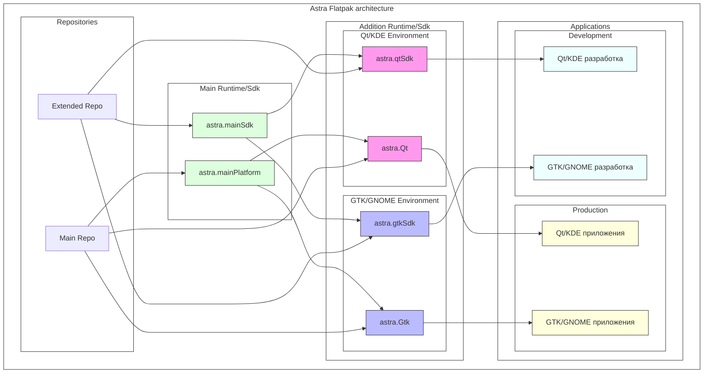

# Архитектура Astra Flatpak

## Базовые компоненты

### Main Runtime/SDK

#### astra.mainPlatform
Базовый runtime, содержащий основные компоненты системы:
- Системные библиотеки и утилиты
- Базовые компоненты безопасности
- Компоненты Parsec
- Основные системные утилиты

#### astra.mainSdk
Базовый SDK для разработки:
- Компиляторы (gcc, g++)
- Инструменты сборки (make, cmake)
- Базовые утилиты разработки
- Заголовочные файлы системных библиотек
- Инструменты отладки

## Дополнительные окружения

### Qt/KDE Environment

#### astra.Qt
Runtime для Qt приложений:
- Qt5 библиотеки
- KDE Frameworks
- Qt плагины
- Системы тем KDE
- Мультимедиа компоненты
- Зависимости Qt приложений

#### astra.qtSdk
SDK для разработки Qt приложений:
- Qt заголовочные файлы
- Qt инструменты разработки
- KDE инструменты разработки
- CMake модули для Qt
- Отладочные инструменты Qt

### GTK/GNOME Environment

#### astra.Gtk
Runtime для GTK приложений:
- GTK библиотеки
- GLib/GObject
- GNOME компоненты
- Системы тем GTK
- Мультимедиа компоненты GTK
- Зависимости GTK приложений

#### astra.gtkSdk
SDK для разработки GTK приложений:
- GTK заголовочные файлы
- GObject инструменты
- GNOME инструменты разработки
- Инструменты сборки GTK
- Отладочные инструменты GTK

