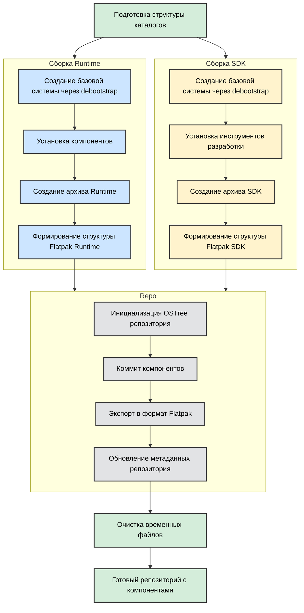

# Сборка Astra Flatpak инфраструктуры

Инструкция описывает процесс локальной сборки всех компонентов Astra Flatpak инфраструктуры.

Все сборочные процессы уже собраны в bash скрипты 

Методология сборки описана схематично:


## Предварительные требования

### Системные требования
- Astra Linux 
- Минимум 20GB свободного места
- Минимум 4GB RAM
- Права sudo

### Необходимые пакеты
```bash
sudo apt-get update
sudo apt-get install -y \
    flatpak \
    flatpak-builder \
    git \
    debootstrap \
    sudo \
    ostree
```

## Получение исходного кода

```bash
git clone https://git.devos.astralinux.ru/AstraOS/flatpak.git
cd flatpak
```

## Структура проекта
```
flatpak/
├── build_all.sh          # Основной скрипт сборки          
└── scripts/              # Скрипты сборки компонентов
    ├── build_main.sh
    ├── build_qt.sh
    ├── build_gtk.sh
```

## Процесс сборки

### Автоматическая сборка всех компонентов
```bash
sudo ./build_all.sh
```

### Порядок сборки компонентов
1. mainPlatform - базовый runtime
2. mainSdk - базовый SDK
3. Qt runtime
4. qtSdk
5. Gtk runtime
6. gtkSdk

### Ручная сборка отдельных компонентов
```bash
# Сборка mainPlatform
sudo ./scripts/build_main.sh

# Сборка Qt компонентов
sudo ./scripts/build_qt.sh

# Сборка GTK компонентов
sudo ./scripts/build_gtk.sh
```

## Проверка результатов сборки

После сборки в каталоге проекта появятся папки repo и build_dir 
### Проверка репозитория
```bash
flatpak remote-add --if-not-exists --no-gpg-verify local-astra repo
flatpak remote-ls local-astra
```

Ожидаемый вывод:
```
org.astra.mainPlatform
org.astra.mainSdk
org.astra.Qt
org.astra.qtSdk
org.astra.Gtk
org.astra.gtkSdk
```

### Тестовая установка компонентов
```bash
flatpak install local-astra org.astra.mainPlatform
flatpak install local-astra org.astra.Qt
```

## Возможные проблемы

### Ошибки debootstrap
При ошибках debootstrap проверьте:
- Доступность репозиториев Astra Linux
- Правильность настройки сети
- Наличие прав sudo

### Ошибки сборки flatpak
- Убедитесь в наличии всех зависимостей
- Проверьте корректность манифестов

## Очистка

### Очистка build директории
```bash
sudo rm -rf build_dir/*
```

