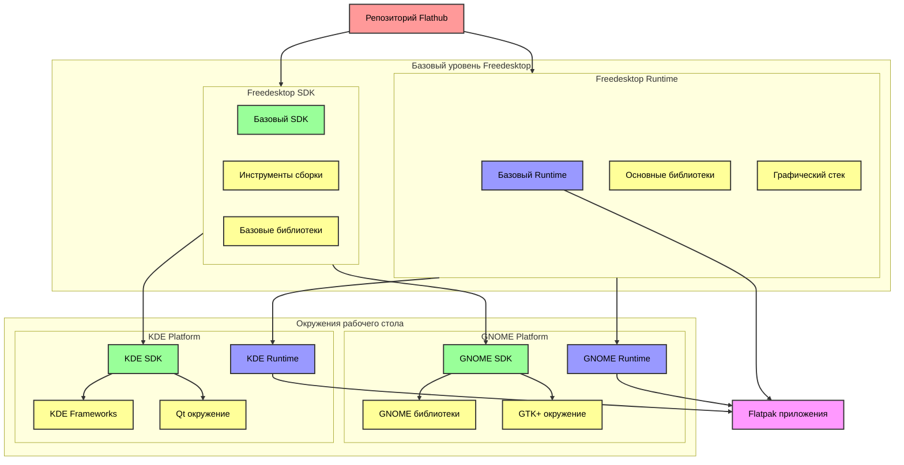

# Локальная сборка сред выполнения Flathub 
В настоящее время доступны три основные среды выполнения: Freedesktop, GNOME и KDE, все из которых размещены на [Flathub](https://flathub.org/). Каждая среда выполнения поставляется с родительским SDK для сборки.
1. Среда [выполнения Freedesktop](https://gitlab.com/freedesktop-sdk/freedesktop-sdk/) — это стандартная среда выполнения, которую можно использовать для любого приложения. Это содержит набор необходимых библиотек, обеспечивает графику и стек набора инструментов и формирует основу сред выполнения GNOME и KDE.

2. Среда [выполнения GNOME](https://gitlab.gnome.org/GNOME/gnome-build-meta) подходит для любого приложения, использующего платформу GNOME. Строится на основе среды выполнения Freedesktop и добавляет библиотеки и компоненты, используется платформой GNOME.

3. Среда [выполнения KDE](https://invent.kde.org/packaging/flatpak-kde-runtime) также основана на среде выполнения Freedesktop и включает в себя Qt и KDE Frameworks. Подходит для любого приложения, использующего KDE платформу и большинство приложений на базе Qt.

## Архитектура



### Клонируйте репозиторий
```bash
git clone https://git.devos.astralinux.ru/AstraOS/flatpak.git
```

### Установите необходимые инструменты
```bash
sudo apt install flatpak flatpak-builder ostree 
```
### Сборка Freedesktop 
```bash
mainline/fd_builder.sh
```
### Сборка Gnome
```bash
mainline/gnome_builder.sh
```
### Сборка Kde
```bash
mainline/kde_builder.sh
```